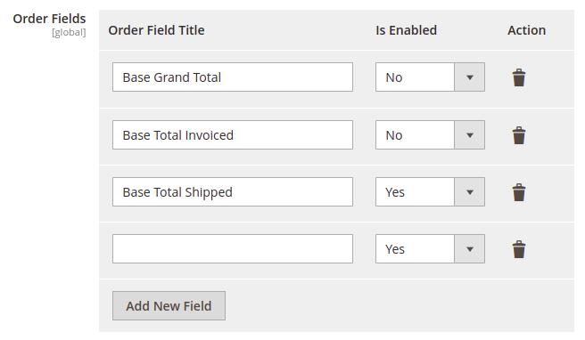

# Description

This module provides interfaces for implementing select objects and inject them into complex configuration fields.

# Usage example:

```xml
<config>
    <!-- Source model with elements, used in system.xml -->
    <!-- You may add custom Source Model with dropdown list if required -->
    <virtualType name="OneFormFieldElementWithCustomSourceModel" type="PerfectCode\CustomConfigElementApi\Block\Adminhtml\Form\Field\AbstractSelectField">
        <arguments>
            <argument name="optionSource" xsi:type="object">Magento\Config\Model\Config\Source\Yesno</argument>
            <argument name="data" xsi:type="array">
                <item name="is_render_to_js_template" xsi:type="boolean">1</item>
            </argument>
        </arguments>
    </virtualType>
    <!-- This is THE MAIN class - FrontEnd model. This should be used in your system.xml -->
    <virtualType name="FrontendModelOrdersForm" type="PerfectCode\CustomConfigElementApi\Block\System\Config\Form\Field\FieldArray\StoreConfigForm">
        <arguments>
            <!-- Your columns are described here. -->
            <argument name="elements" xsi:type="array">
                <item name="order_field_title" xsi:type="array">
                    <item name="name" xsi:type="string">order_field_title</item>
                    <item name="label" xsi:type="string">Order Field Title</item>
                    <item name="class" xsi:type="string">required-entry</item>
                </item>
                <item name="is_enabled" xsi:type="array">
                    <item name="name" xsi:type="string">is_enabled</item>
                    <item name="label" xsi:type="string">Is Enabled</item>
                    <item name="class" xsi:type="string">required-entry</item>
                    <!-- If you added custom SourceModel you may use it as field renderer. -->
                    <item name="renderer" xsi:type="object">OneFormFieldElementWithCustomSourceModel</item>
                </item>
            </argument>
            <argument name="buttonLabel" xsi:type="string">Add New Field</argument>
        </arguments>
    </virtualType>
    <!-- END. Source model with elements, used in system.xml -->
</config>
```

system.xml field:
```xml
<!-- This is the form inside  -->
<field id="order_fields" translate="label" sortOrder="100" showInDefault="1" showInWebsite="0" showInStore="0">
    <label>Order Fields</label>
    <frontend_model>FrontendModelOrdersForm</frontend_model>
    <backend_model>Magento\Config\Model\Config\Backend\Serialized\ArraySerialized</backend_model>
</field>
```
This is an example form. All names are random:


